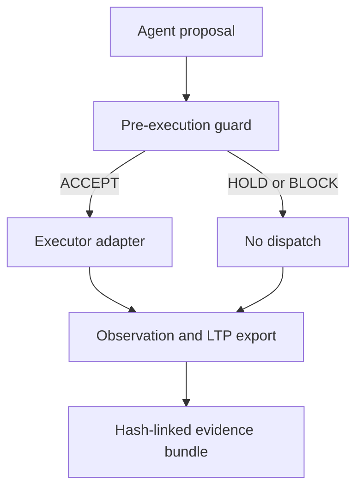

# Causal Cell

**The smallest verifiable unit of an agent action.**

Causal Cell is a provider-neutral reference kernel that treats every model
output as a proposal, evaluates trusted authority and policy before dispatch,
and preserves authorization, observation, continuity, and evidence as separate
records.

Status: `v0.1.0` alpha reference implementation.



## Core invariant

```text
proposal ≠ authorization ≠ execution ≠ observation ≠ verification
```

- `ACCEPT` permits the executor adapter to be called.
- `HOLD` waits for bound approval or revalidation and does not dispatch.
- `BLOCK` rejects malformed, expired, replayed, out-of-scope, action/scope-
  confused, or denied work and does not dispatch.
- A process-local atomic store consumes both `nonce` and `idempotency_key`
  before the executor callback.
- Every attempt receives a unique evidence directory; a replay cannot overwrite
  the original attempt.

## Quick start

```bash
python -m pip install --no-deps -e .
python -m unittest discover -s tests -v
python -m benchmarks.run_safety_matrix
```

Evaluate a proposal without executing anything:

```bash
python -m causal_cell evaluate \
  --proposal examples/fixtures/safe-proposal.json \
  --policy examples/fixtures/policy.json \
  --now 2026-08-27T21:00:00Z
```

Run the synthetic approval-to-dispatch example:

```bash
python examples/smart_contract_release.py --evidence-root evidence/demo
```

The example first returns `HOLD`, then accepts a separately bound approval,
invokes one synthetic executor, and locally verifies both evidence bundles. It
does not use RPC, credentials, a wallet, customer data, or real value.

## What one bundle contains

| Layer | Artifact | Meaning |
|---|---|---|
| Intent | `intent.json` | Application-supplied intent and causal parent |
| Action | `proposal.json` | Exact digest-bound proposal |
| Authorization | `authorization.json` | `ACCEPT`, `HOLD`, or `BLOCK` before dispatch |
| Result | `observation.json` | What the runtime observed at the callback boundary |
| Response integrity | `response-integrity.json` | Kept separate; `NOT_EVALUATED` in v0.1 |
| Causal audit | `causal-audit.json` | Causal validity and compact findings |
| Continuity | `ltp-continuity-input.json` | LTP v0.1 request/outcome envelope snapshot |
| Replay | `replay-trace.json` | Decision-path events, not external-effect replay |
| Integrity | `ledger.jsonl`, `manifest.json` | Hash chain plus exact size/SHA-256 inventory |

The verifier rejects changed bytes, broken ledger ancestry, unsafe paths,
duplicate roles, missing files, and unlisted-file injection.

## Relationship to the existing stack

Causal Cell is deliberately thin:

- **ProofPath** remains the authority/guard responsibility.
- **ContractGraph-QA** remains the source of smart-contract receipts, events,
  state, and technical evidence.
- **LTP** remains the normative request/outcome continuity verifier. Causal Cell
  exports its versioned envelope shapes; it does not reinterpret an LTP verdict.
- **LiminalDB** remains the durable transition-ledger destination. The local
  JSONL ledger here is only a handoff/reference format.

Exact inspected revisions and mapping details are in
[docs/INTEGRATIONS.md](docs/INTEGRATIONS.md).

## Measured local baseline

The synthetic matrix covers 16 decision cases plus a runtime replay exercise:

- 16/16 expected decisions matched;
- 100% detection across fixtures expected to be held or blocked;
- 0 false positives and 0 false negatives in that bounded matrix;
- 100% bundle completeness for the two runtime attempts;
- one executor call across original + replay.

These are synthetic fixture results, not production-security or universal
detection claims.

## Honest boundaries

Version `v0.1` does **not** provide:

- an OS/container/VM sandbox — the Python callback is in-process;
- a persistent or distributed nonce transaction;
- cryptographic approval signatures or key management;
- independent truth verification of an executor response;
- blockchain finality, evidence authenticity, or complete history;
- external exactly-once side effects.

Production callers must use a durable atomic replay store and a thin adapter to
an externally contained executor. See [the specification](docs/SPEC_V0_1.md)
and [threat model](docs/THREAT_MODEL.md).

## License

Apache-2.0.
